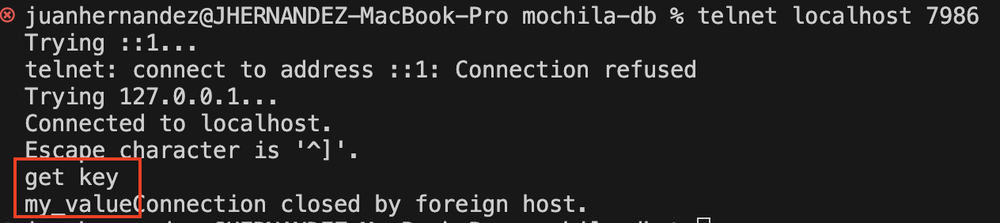

# MOCHILADB - Base de datos en memoria

Pequeña base de datos en memoria hecha por pasar el rato escrito en C.


Actualmente la base de datos en memoria es capaz de:
- **SET**: usando el comando set agregar cadenas (sin espacio) a la memoria
- **GET**: usando el comando get retorna, dado la key, una valor
- **LIST**: usando el comando list imprime en un hilo aparte las key-value de la tabla hash en ese momento.

## Enseñanza
Para mi curso de diseño de sistemas:
- Programación en C
- Uso de hilos en C
- Network programming
- Diseño de sistemas
- Uso de estructuras de datos

## Estructuras de datos

- Hashtable
- Queue (linked list implementation)

## Características

- [x] Store data (only strings) en memoria
- [x] Obtener datos almacenados en memoria
- [x] Servidor concurrente (event loop básico)
- [x] Archivo de configuración de servidor
- [x] Dockerización
- [x] Hash table básic
- [ ] encriptación
- [ ] TLS
- [x] integridad de los datos
- [ ] CLI con algunos comandos

## Características futuras

- [ ] Multitheading
- [ ] Rehashing
- [ ] Bloqueo de grano fino / bloqueo por segmentos
- [ ] persistencia en archivo (configuración)
- [ ] hot reload
- [ ] Agregar funcionalidad de eliminar una entrada en la tabla hash
- [ ] agrupar entradas bajo una misma clave
- [ ] ¿diseño distribuido? ¿mochiladb cluster?


## Installation

Puedes usarlo dockerizado o compilandolo.

*Nota: aún no se está publicando en DockerHub, tendrás que clonar el repo*

Git clone
```
git clone https://github.com/berracode/mochilaDB.git
cd mochilaDB
git checkout master
```

### 1. Con Docker (usando el código fuente)

#### Crear imagen docker
```
docker build -t mochila-i .
```

#### Ejecutar contenedor

```
docker run --name mochila-i-con -d -p 7986:7986 mochila-i:latest
```

### 2. Con Make (Compilando en tu máquina con linux o macos)

Una vez hecho el clone podras usar los siguientes comandos

#### compilar con make
```
make prod
```

#### ejecutar

```
./bin/mochiladb
```

## Usage

Para usar la base de datos en memoria, una vez ejecutado con dokcer o compilada con make y luego ejecutado el binario, mochiladb está lista para recibir peticiones en **localhost:7986**

Comandos disponibles:
- **set key value** (el valor es un string sin espacio actualmente): almacena un valor en la bd.
- **get key**: retorna un valor dado una key.
- **list**: imprime en un archivo todas las key y values que esten en la base de datos.

### Telnet

Usando telnet puedes comunicarte con el servidor usando uno de los 3 comando disponibles hasta ahora, así: 

#### Conectar con el servidor

```
telnet localhost 7986
```

Verás esto en la terminal luego de dar ENTER.


#### Almacenar un valor en memoria
Escribe el siguiente comando
```
set your_key your_value
```

Debe verse así:


Y al presionar enter se enviará la petición al servicor y podrás ver un mensaje de respuesta "OK", indica que tu valor fue almacenado en memoria. 


#### Obtener un valor dado una clave

Una vez hayas establecido la conexión al servidor el comando para obtener es get, así:

```
get key
```
Y al darle ENTER, debes ver tu valor obtenido desde el servidor, algo como esto:




## Valgrind commands

### Valgrind con Helgrind para detectar problemas de concurrencia

```
valgrind --tool=helgrind --read-var-info=yes ./bin/mochiladb 2> helgrind_output.txt
```

### Fugas de memoria
```
valgrind --tool=memcheck --leak-check=full --track-origins=yes ./bin/mochiladb
```


```
valgrind --tool=memcheck --leak-check=full --track-origins=yes --show-reachable=yes ./bin/mochiladb
```

